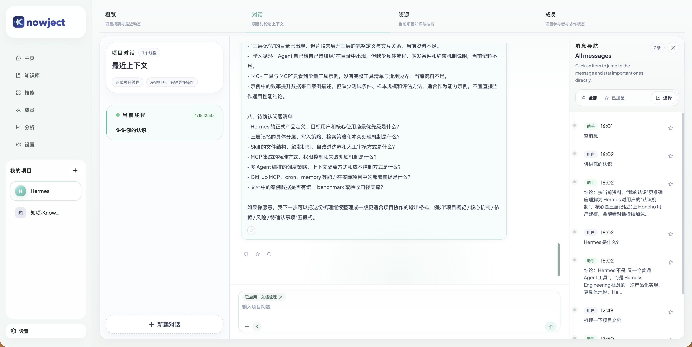

# Knowject

<p align="center">
  
</p>

<p align="center">
  <strong>Make project knowledge truly usable for teams.</strong>
</p>

<p align="center">
  Knowject is a source-available AI workspace that turns documents, repository context,
  project resources, and team workflows into reusable project memory.
</p>

<p align="center">
  <a href="./README.zh-CN.md">简体中文</a>
  ·
  <a href="./docs/README.md">Documentation</a>
  ·
  <a href="./CONTRIBUTING.md">Contributing</a>
  ·
  <a href="./SECURITY.md">Security</a>
</p>

## Why Knowject

Teams do not usually fail because information is missing. They fail because project knowledge is scattered across repositories, documents, chat threads, design files, and personal memory.

Knowject is built to make that knowledge:

- searchable through a formal knowledge pipeline instead of ad-hoc copy/paste
- reusable inside project chat instead of trapped in static documents
- governable through projects, members, skills, settings, and explicit contracts
- grounded in the real repository and real project assets instead of generic AI output

## What You Get Today

The repository is already beyond a prototype shell. The current baseline includes:

- authenticated product shell with project routes, global asset pages, members, and settings
- formal Express API for `auth`, `projects`, `members`, `knowledge`, `skills`, `agents`, and `settings`
- project chat read/write flow with SSE streaming, message replay/edit, source seeds, and citation patch events
- project-private knowledge plus global knowledge CRUD, upload, diagnostics, retry, rebuild, and search
- structured Skill governance with binding validation and project-chat skill injection
- Python indexing runtime for parsing, chunking, embedding, and Chroma orchestration
- locale negotiation across frontend and backend
- Docker-based local and production-style deployment baselines

## Core Product Surface

### Global workspace

- `/login`
- `/home`
- `/knowledge`
- `/skills`
- `/members`
- `/analytics`
- `/settings`

### Project workspace

- `/project/:projectId/overview`
- `/project/:projectId/chat`
- `/project/:projectId/chat/:chatId`
- `/project/:projectId/resources`
- `/project/:projectId/members`

## Key Capabilities

| Area | Current baseline |
| --- | --- |
| Project Chat | Thread creation, rename/delete, SSE streaming, stop-generation, replay/edit, source seeds, citation patch |
| Knowledge | Global + project-private knowledge bases, document upload, diagnostics, retry, rebuild, search |
| Skills | Structured team Skills, binding validation, project-chat Skill selection |
| Members | Global member overview and project roster flows |
| Settings | Workspace embedding, LLM, indexing, and locale preference management |
| Infra | Docker Compose baseline, MongoDB primary store, Chroma vector store, Python indexer |

## Monorepo Architecture

```text
apps/
  platform/    React frontend product shell
  api/         Express business API
  indexer-py/  Python indexing runtime
packages/
  request/     Shared HTTP client package
  ui/          Shared UI components
docs/          Project documentation source of truth
.agents/       Shared project skills
.codex/        Project-local Codex configuration
```

### Runtime responsibilities

- `apps/platform`: authenticated shell, global asset pages, project pages, settings center
- `apps/api`: auth, locale, envelope, business modules, project conversation orchestration
- `apps/indexer-py`: file parsing, chunking, embeddings, Chroma write/delete, diagnostics
- `packages/request`: shared request wrapper and error handling

## Tech Stack

- Frontend: React 19, Vite 7, Ant Design 6, Tailwind CSS 4
- API: Express 4, TypeScript, MongoDB Node.js Driver
- Indexing: Python 3.12+, `uv`, Chroma
- Auth: JWT + `argon2id`
- Tooling: pnpm workspace, Turborepo, ESLint, Prettier
- Infra: Docker Compose, MongoDB, Chroma, Caddy

## Quick Start

### Requirements

- Node.js >= 22
- pnpm 10
- Python 3.12+
- `uv`

### Host workflow

```bash
cp .env.example .env.local
pnpm install
pnpm dev
```

`pnpm dev` starts `platform + api + indexer-py` through the workspace.

### Recommended local workflow with Docker-managed dependencies

```bash
pnpm dev:init
pnpm dev:up
```

### Useful commands

```bash
pnpm dev:web
pnpm dev:api
pnpm test
pnpm check-types
pnpm build
pnpm verify:global-assets-foundation
pnpm verify:index-ops-project-consumption
pnpm verify:core-loop-readiness
pnpm docker:local:health
pnpm knowject:help
```

## Current Deployment Facts

- MongoDB is the primary business datastore.
- Chroma is used for retrievable vector storage behind stable namespace keys.
- `apps/indexer-py` handles parsing, chunking, embedding generation, and Chroma mutation flows.
- The project chat runtime already consumes saved workspace LLM settings through a unified `chat/completions`-compatible path.
- Public health exposure is intentionally minimal through `GET /api/health`.

## Documentation

`docs/` is the documentation source of truth. `docs/exports/` is a derived export layer and not the primary fact surface.

- [Project Rules](./AGENTS.md)
- [Documentation Index](./docs/README.md)
- [Current Architecture](./docs/current/architecture.md)
- [Project Chat Sources](./docs/current/project-chat-sources.md)
- [Skills Governance](./docs/current/skills-governance.md)
- [Contracts Index](./docs/contracts/README.md)
- [Chat Contract](./docs/contracts/chat-contract.md)
- [Skills Contract](./docs/contracts/skills-contract.md)
- [Platform README](./apps/platform/README.md)
- [API README](./apps/api/README.md)
- [Docker README](./docker/README.md)

## Contributing

Contributions are welcome. Start with [CONTRIBUTING.md](./CONTRIBUTING.md) for setup, workflow expectations, validation rules, and documentation sync requirements.

## Security

For vulnerability reporting and current support scope, see [SECURITY.md](./SECURITY.md).

## License

This repository is currently distributed under the
[Knowject Proprietary Source-Available License](./LICENSE).

Personal, non-commercial learning, private study, evaluation, and
non-production experimentation are allowed. Commercial use, company use,
client use, deployment, hosting, SaaS, distribution, or monetized derivative
work requires the Licensor's prior written permission.
